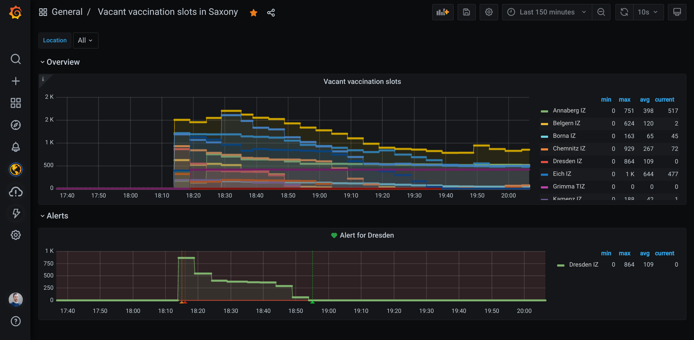

# counteeexporter

In my region, you need to use a [dashboard by Countee][countee_dashboard] to get informed about vacant vaccination slots. I have built _counteeexporter_ on a whim because it is a waste of time to check the official dashboard several times a day only to find out that there are no free slots. It leverages the Countee API to fetch the information and exposes the results in the Prometheus [exposition format][expostion_format]. That means you can use _counteexporter_ as a scrape target for [Prometheus][prometheus] and create automated alerts for vacant slots in a vaccination centre of your choice.

You don't need to set up a Prometheus instance yourself to use _counteeexporter_. My recommendation is to get a free [Grafana cloud account][grafana_cloud]. You can use the [Grafana agent][grafana_agent] to send the collected data to your managed Prometheus instance. Check the [deploy branch][deploy_branch] to get an idea of how you could set this up.

The screenshot below shows, that several hundreds of vacant slots just appear out of the blue after a long period with no availability. You need to be really fast in metropolitan areas because they are booked within minutes. [Here is a snapshot of the timeframe displayed in the picture.][grafana_snaphshot]

**Disclaimer:** I did not find official documentation for the Countee API so the exporter probably only works with the endpoint I was interested in.

[countee_dashboard]: https://www.countee.ch/app/de/counter/impfee/_iz_sachsen
[expostion_format]: https://github.com/prometheus/docs/blob/master/content/docs/instrumenting/exposition_formats.md
[prometheus]: https://prometheus.io/
[grafana_cloud]: https://grafana.com/products/cloud/
[grafana_agent]: https://github.com/grafana/agent
[deploy_branch]: https://github.com/usommerl/counteeexporter/tree/deploy
[grafana_snaphshot]: https://usommerl.grafana.net/dashboard/snapshot/utOX7mqkj4ofFQaQ369Be5SYFf3qNtrL
